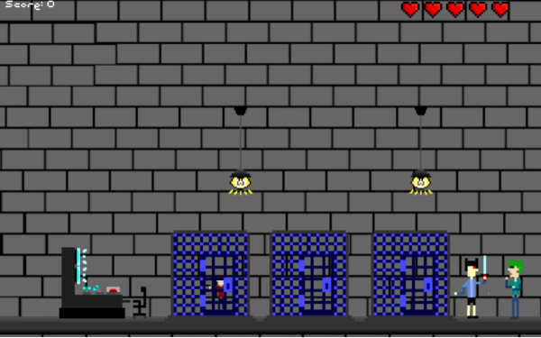
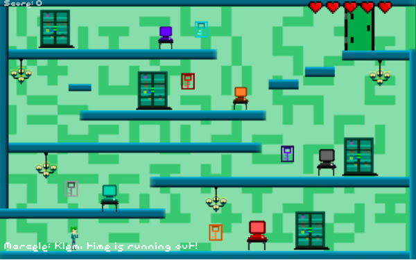

# Double Strike

Clementina and Marsel are captured in cyberspace by the evil Nogzor and in this game you have to help them escape by destroying cunning plans of the invader!  
Each of the characters have unique abilities: Marsel - teleports and totally-not-letal gun and Clementina owns hand-to-hand combat techniques.  
Under your leadership they will definitely win!  

Language: JavaScript (UnityScript)  
Unity version: 2017.1.5f1  
How to play: [Download](https://github.com/phoenixEkb/UnityGroupGameProject/releases/tag/1.0.0) and run in the browser (try Microsoft Edge first)

Controls:  
W, A, D - control keys       
Spacebar - character swap  
F - hit with Clementina or shoot with Marsel
C - block with Clementina  
T, Y - move Marsel between the platforms  
H - throw lamp  

Developed by The Cake Is Undefined team, Ural Federal University, IRIT-RTF, RI-330901   
 -  Game logic, AI and physics developement
 - Game logic, AI and physics developement  
 - Art, animation, design document
Ostrovsky Sergey - Level logic development, deployment, design document, music and sounds   

Finished in 2015 in Mercurial, moved to GitHub due to end of support of Mercurial by Atlassian  
